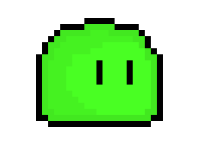
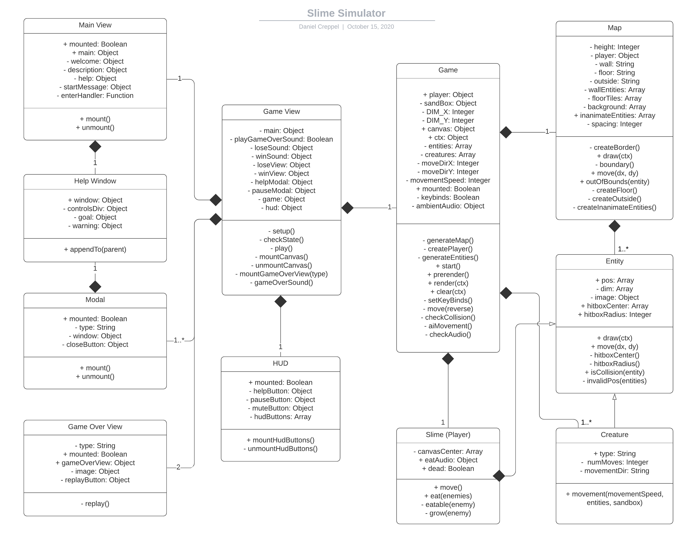

# [Slime-Sim](https://dancreppel.github.io/Slime-Sim/) 

# Background
Start as the weakest monster, a slime.  However, you do not have to stay as the weakest creature.  Climb the monster food chain by consuming other creatures.  This game is a top down simulator.  Move around the map using your directional keys and eat those smaller than yourself.

# Functionality & MVPs Checklist
- [x] Main menu
  - [x] Start game button
  - [x] Game description with instructions
- [x] Game view
  - [x] Pause button
  - [x] Help button
  - [x] Mute button
- [x] Gameplay
  - [x] Movement with directional keys
  - [x] Hit detection
  - [x] Basic combat
- [x] Audio
  - [x] Map ambient noises
  - [x] Sound effects

# UML


# Features
## **Game View**
### *The game view manages which view should be rendered depending on the state of the app.*
The browser's localStorage stores the state of the website. 
```javascript
  // default state starts with main menu
  localStorage.setItem('state', 'main');
```
A switch statement manages views that are visible depending on the localStorage state.
```javascript
  switch (localStorage.state) {
        case "main":
          this.main.mount();
          this.setup();
          break;
        case "play":
          this.main.unmount();
          this.playGameOverSound = true;
          this.game.start();
          this.mountCanvas();
          this.play();
          this.hud.mountHudButtons();
          break;
        case "pause":
          this.pauseModal.mount();
          break;
        case "help":
          this.helpModal.mount();
          break;
        case "win":
          this.hud.unmountHudButtons();
          this.game.ambientAudio.pause();
          this.unmountCanvas();
          this.mountGameOverView("win");
          this.gameOverSound();
          break;
        case "lose":
          this.game.ambientAudio.pause();
          this.hud.unmountHudButtons();
          this.unmountCanvas();
          this.mountGameOverView("lose");
          this.gameOverSound();
          break;
        default:
          break;
      }
```

## **Game**
### *The game class manages the map, entities, keybinds, and render logic.*

Keybinds are mounted when game is loaded.
```javascript
  // handle keydownfor arrow keys
  document.addEventListener("keydown", (e) => {
    e.preventDefault();
    let speed = this.movementSpeed;
    switch (e.key) {
      case "ArrowUp":
        this.moveDirY = speed;
        break;
      case "ArrowDown":
        this.moveDirY = -speed;
        break;
      case "ArrowLeft":
        this.moveDirX = speed;
        break;
      case "ArrowRight":
        this.moveDirX = -speed;
        break;
      default:
        break;
    }
  });
```

The game also controls the rendering of the entities and sandbox.
```javascript
  render (ctx) {
    this.sandBox.draw(ctx);
    this.entities.forEach((entity) => entity.draw(ctx));
    this.creatures.forEach((creature) => creature.draw(ctx));
    this.player.draw(ctx);
  }
```

## **Hit Detection**
### *Hit detection determines when objects are within the vicinity of a target.*

The map creates a simple boundary and prevents entities from roaming out of bounds.
```javascript
  boundary () {
    // Bounds are determined by their X or Y values
    // ex: X = 0 or Y = 10
    // top bound in terms of Y
    this.topBound = this.spacing;
    // right bound in terms of X
    this.rightBound = this.height;
    // bottom bound in terms of Y
    this.bottomBound = this.height;
    // left bound in terms of X
    this.leftBound = this.spacing;
  }

  outOfBounds (entity) {
    // check if entity's hitbox is above top bound
    if (entity.hitboxCenter[1] - entity.hitboxRadius < this.topBound) return true;
    // check if entity's hitbox is below bottom bound
    if (entity.hitboxCenter[1] + entity.hitboxRadius > this.bottomBound) return true;
    // check if entity's hitbox is out of left bound
    if (entity.hitboxCenter[0] - entity.hitboxRadius < this.leftBound return true;
    // check if entity's hitbox is out of right bound
    if (entity.hitboxCenter[0] + entity.hitboxRadius > this.rightBound) return true;
    // otherwise
    return false;
  }
```

The entity class creates a circular hitbox for all entities.
```javascript
  hitboxCenter() {
    let hitboxCenter = this.pos.map((_, i) => this.pos[i] + this.dim[i] / 2);
    return hitboxCenter;
  }

  hitboxRadius() {
    return this.dim[0] < this.dim[1] ? this.dim[0] / 2 : this.dim[1] / 2;
  }
```

Additionally, the entity class will check when an entity collides with another.
```javascript
  isCollision(entity) {
    let dx = this.hitboxCenter[0] - entity.hitboxCenter[0];
    let dy = this.hitboxCenter[1] - entity.hitboxCenter[1];
    let distance = Math.sqrt(dx * dx + dy * dy);
    let minDistance = this.hitboxRadius + entity.hitboxRadius;

    if (distance < minDistance) return true;
    else return false;
  }
```

## **Movement**
### *Movement shifts the frame of reference rather than the character itself.*

Move adjusts the position of the entities and their hitboxes.
```javascript
  move(dx, dy) {
    this.pos[0] += dx;
    this.pos[1] += dy;
    this.hitboxCenter[0] += dx;
    this.hitboxCenter[1] += dy;
  }
```

The player's pos is never changed.  Only the entities' positions relative to the player is changed.
```javascript
  move () {
    // Do not move because the player should be in the center of the frame of
    // reference
  }
```

## **Combat**
### *Combat is relatively simple.  If the player is larger than the enemy and makes contact, the enemy is consumed.  Otherwise, the player dies.*

Before every rendered frame, the game checks if all entities are eatable.  If an enemy is eatable then that entity is pronounced dead and is deleted from the creatures array.
```javascript
  eat (enemies) {
    enemies.forEach((enemy, i) => {
      if (this.eatable(enemy)) {
        this.grow(enemy);

        // play eating noise
        this.eatAudio.play();

        if (enemy.type === 'boss') {
          enemy.dead = true;
        } else {
          // remove enemy
          delete enemies[i];
        }
      }
    });
  }
```

An entity is considered eatable if its radius is smaller than the player's radius and the distance of the its center from the player's center is less than the radius of the player's hitbox.  The inverse is applied if the enemie's hitbox is larger than the players.  When a player is eaten, the event triggers a game loss.
```javascript
  eatable (enemy) {
    let dx = this.hitboxCenter[0] - enemy.hitboxCenter[0];
    let dy = this.hitboxCenter[1] - enemy.hitboxCenter[1];
    let distance = Math.sqrt(dx * dx + dy * dy);
    
    let minDistance;
    minDistance = this.hitboxRadius > enemy.hitboxRadius
      ? this.hitboxRadius 
      : enemy.hitboxRadius;

    if (distance < minDistance && this.hitboxRadius < enemy.hitboxRadius) {
      this.dead = true;
    }

    if (distance < minDistance && this.hitboxRadius > enemy.hitboxRadius) {
      return true;
    } else return false;
  }
```

If the player successfully eats an enemy, then the character will grow based on theoretical volume.
```javascript
  grow (enemy) {
    let enemyVolume = Math.pow(enemy.hitboxRadius, 3) * Math.PI * 4 / 3;
    let playerVolume = Math.pow(this.hitboxRadius, 3) * Math.PI * 4 / 3;
    let newVolume = enemyVolume + playerVolume;
    let newRadius = Math.pow(newVolume / Math.PI * 3 / 4, 1 / 3);
    // apply new radius
    this.hitboxRadius = newRadius;
    // apply new dimensions using diameter
    this.dim = [newRadius * 2, newRadius * 2];
    // adjust center of model
    this.pos = this.hitboxCenter.map((_, i) => this.hitboxCenter[i] - this.dim[i] / 2);
  }
```

# Architecture and Technologies
* Html
* SCSS
* Canvas
* JavaScript
